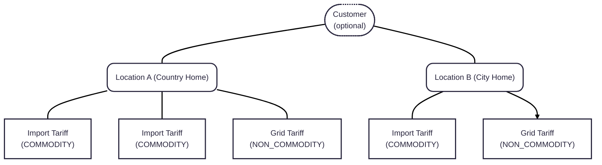

## Overview

When integrating Flatpeak with an existing customer base where tariff data is missing, you can onboard users by assigning a default dynamic tariff programmatically. This process is headless and designed for scale.

The example below shows a simple three-step flow to:
1. Create a customer
2. Create a Location for each Customer.
3. Auto-assign the market tariff for that region, with an optional fixed surcharge (e.g. +$0.02/kWh).

This approach lets your customers immediately benefit from energy price data in your system, while still encouraging them to connect their actual tariff later via Connect for full optimisation accuracy.

## Implementation

<Steps>
<Step title="Create Customer object (optional)">

If your systems maintain a separate reference for customer (i.e., user) objects, independent of their address, you can create a Customer object in Flatpeak to keep your object model aligned. Call the [customer-create](/api-reference/zero/customers/create-a-customer) endpoint and pass your internal customer reference as `reference_id`.

The response will return a Flatpeak Customer ID (`customer_id`), which you should store and associate with the customer in your systems.

<CodeGroup>
```json Example request
curl --request POST \
  --url https://api.flatpeak.com/customers \
  --header 'Authorization: Bearer <token>' \
  --header 'Content-Type: application/json' \
  --data '{
  "reference_id": "CUS1234567890"
}'
```
```json Example response
{
  "id": "cus_65e421d1daa4a24082b4f590",
  "object": "customer",
  "live_mode": true,
  "reference_id": "CUS1234567890"
}
```
</CodeGroup>  

</Step>
<Step title="Create Location object">

Before creating tariffs, you must first create a Location object using the [location-create](/api-reference/zero/locations/create-a-location) endpoint. Pass your internal location reference as `reference_id`. The response will return a Flatpeak Location ID (`location_id`), which you must permanently store and associate with the device location in your system.

At minimum, you must pass `postal_address.city` and `postal_address.country_code`. If the device is located in the US, you must also include `postal_address.state`. These fields enable Flatpeak to determine the correct timezone, currency, and market rates for the specified location.

<Check>If you created a Customer Object in the optional step above, you **must** include it in this Location Create request using the `customer_id` field.</Check>

<CodeGroup>
```json Example request highlight {7}
curl --request POST \
  --url https://api.flatpeak.com/locations \
  --header 'Authorization: Bearer <token>' \
  --header 'Content-Type: application/json' \
  --data '{
  "reference_id": "LOC1234567890",
  "customer_id": "cus_65e421d1daa4a24082b4f590",
  "postal_address": {
    "address_line1": "1-3 Strand",
    "city": "London",
    "state": "Greater London",
    "post_code": "WC2N 5EH",
    "country_code": "GB"
  }
}'
```
```json Example response highlight {2}
{
  "id": "loc_641b90b758fb8e6293716e40",
  "object": "location",
  "reference_id": "LOC1234567890",
  "timezone": "Europe/London",
  "currency_code": "EUR",
  "postal_address": {
    "address_line1": "1-3 Strand",
    "city": "London",
    "state": "Greater London",
    "post_code": "WC2N 5EH",
    "country_code": "GB"
  }
}
```
</CodeGroup>
</Step>
<Step title="Create Tariff object">

Once you have a Location ID, you can [create a tariff](/api-reference/zero/tariffs/create-a-tariff-element) object.

Flatpeak’s tariff model is highly flexible, supporting advanced structures that include market-based pricing, transmission fees, consumption tiers, seasonal rates, and special day overrides.

In the example below, we create a simple tariff where the customer pays a fixed `€0.02123` per kWh on top of the market rate for their location:

| Object/Parameter  | Description                           |
| :----------------- | :------------------------------------- |
| `location_id` | Flatpeak Location ID, to which this tariff applies from **Step 1**. |
| `direction` | `IMPORT` |
| `type` | `COMMODITY` |
| `display_name` | Name of the tariff, e.g. `GB Wholesale Tracker`. |
| `contract_start_date` | Date when the contract between your customer and their energy provider has begun. If you don't have this information, set it to today's date. |
| `contract_end_date` | Date when the contract between your customer and their energy provider has ended or will end. If you don't have this information, set it to today's date + 1 year. |
| `schedule.months`  | Specifies months when tariff applies. Set to `All`. |
| `schedule.days_and_hours.days`  | Specifies days when tariff applies. Set to `All`. |
| `schedule.days_and_hours.hours`  | Specifies hours when this tariff applies. Set to align with the example below when your customer is on a fixed tariff rate. Set `rates.surcharge_fixed` to their tariff surcharge rate in **large** currency units, i.e. €0.02123¢. |

<CodeGroup>
```json Example request highlight {6,12,29}
curl --request POST \
  --url https://api.flatpeak.com/tariffs/elements \
  --header 'Authorization: Bearer <token>' \
  --header 'Content-Type: application/json' \
  --data '{
  "location_id": "loc_641b90b758fb8e6293716e40",
  "direction": "IMPORT",
  "type": "COMMODITY",
  "display_name": "GB Wholesale Tracker",
  "contract_start_date": "2024-01-24T00:00:00Z",
  "contract_end_date": "2025-01-24T00:00:00Z",
  "market_rates": true,
  "schedule": [
    {
      "months": [
        "All"
      ],
      "days_and_hours": [
        {
          "days": [
            "All"
          ],
          "hours": [
            {
              "valid_from": "00:00:00",
              "valid_to": "00:00:00",
              "rate": [
                {
                  "surcharge_fixed": 0.02123
                }
              ]
            }
          ]
        }
      ]
    }
  ]
}'
```
``` json Example response
{
  "id": "trf_66ba584eb6923d7c3b942ef6",
  "object": "tariff",
  "location_id": "loc_641b90b758fb8e6293716e40",
  "connection_type": "MANUAL",
  "direction": "IMPORT",
  "type": "COMMODITY",
  "timezone": "Europe/London",
  "market_rates": true,
  "market_rate_source_id": "mrs_641b90b758fb8e6293716e40",
  "contract_start_date": "2024-01-24T00:00:00Z",
  "contract_end_date": "2025-01-24T00:00:00Z",
  "schedule": [
    {
      "months": [
        "All"
      ],
      "days_and_hours": [
        {
          "days": [
            "All"
          ],
          "hours": [
            {
              "valid_from": "00:00:00",
              "valid_to": "00:00:00",
              "rate": [
                {
                  "surcharge_fixed": 0.02123
                }
              ]
            }
          ]
        }
      ]
    }
  ]
}
```
</CodeGroup>
</Step>
</Steps>

## Next steps

After adding the tariff, you can access:

  - Energy [scheduling](/guides/scheduling) endpoints,
  - Energy [cost reporting](/guides/reporting) endpoints

<Accordion icon="lightbulb" title="Learn more about object relationships, tariff types and directions">

Flatpeak stores tariff information (Tariff) in a many-to-one relationship with a Location (also referred to as the supply address). Each tariff also specifies the direction of energy flow—IMPORT or EXPORT.

Because multiple tariffs can apply to the same location (e.g. commodity pricing, grid fees, export compensation), Flatpeak refers to each one as a **tariff element**. Together, these elements form the full energy cost at that location. You can access the combined result using the [raw tariff rates](/api-reference/zero/tariffs/get-tariff-rates) endpoint.



#### Supported Tariff Combinations

Flatpeak supports the following combinations of tariff type and energy flow direction to cover all major business cases:

| Type/Direction               | Description                                                             |
| :----------------- | :---------------------------------------------------------------------- |
| `COMMODITY`+`IMPORT`        | Cost of the electricity consumed. Essential to enable this—it’s foundational across all markets. |
| `COMMODITY`+`EXPORT`        | Price for exported electricity. Use this if your users have solar panels or energy storage.  |
| `NON_COMMODITY`+`IMPORT`    | Delivery costs (e.g., **grid fees**). Recommended if your customer pays delivery charges separately. |

</Accordion>
