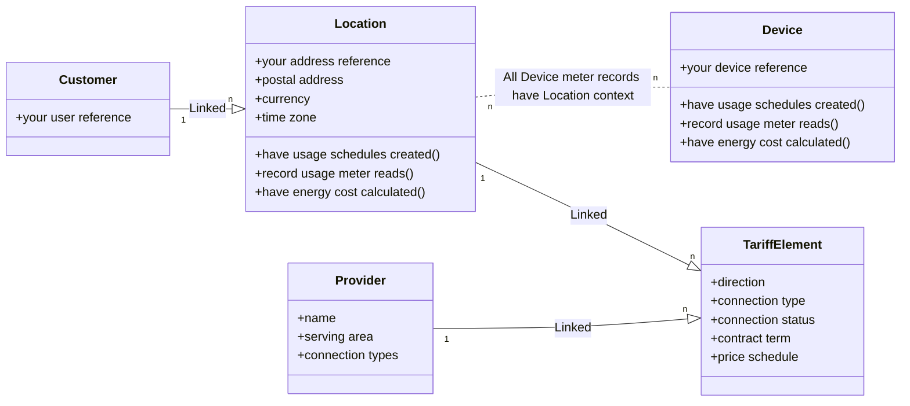

The Flatpeak API is organised around a set of core objects. The diagram below illustrates the relationships between these objects, along with their key attributes and methods. Click any object to view its corresponding API reference.

A summary of each object and its key properties is provided below:

| Object           | Description                                                                                                                                             | Key properties                                |
|:------------------|:---------------------------------------------------------------------------------------------------------------------------------------------------------|:----------------------------------------------|
| `Customer`        | A user in your system.                                                                                                                                   | *Your user reference*                          |
| `Location`        | A physical address (supply address) where electricity is delivered under a contract with an energy provider — e.g. flat, house, office, or factory. | *Postal address, linked Tariff(s), energy consumption and/or export history* |
| `Tariff(Element)` | A cost component of electricity supply at a Location, based on one or more contracts — e.g. energy usage rates or network charges. TariffElement objects are typically created automatically via the [Connect](/plan) flow and kept up to date by Flatpeak in the background, usually refreshed once per day.                 | *Price (e.g. energy cost) schedule*               |
| `Device`          | A physical device (e.g. EV, charger, battery, HVAC). Devices are not directly linked to Locations, but an internal association is created when you submit meter readings, as these are always contextual to the device’s current location. | *Your device reference, energy consumption and/or export history* |
| `Provider`        | Identifies the energy provider for a Tariff Element, allowing you to track which organisation supplies electricity to your users.                        | *Name, served area*                            |

<Info>See the [FAQ](/faq) to learn more about energy markets and Flatpeak service concepts.</Info>
